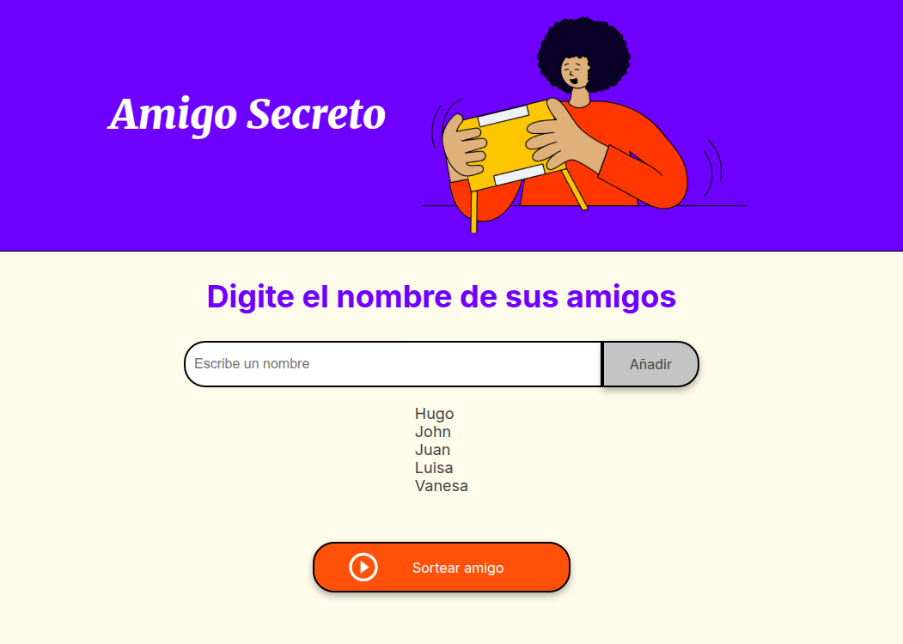
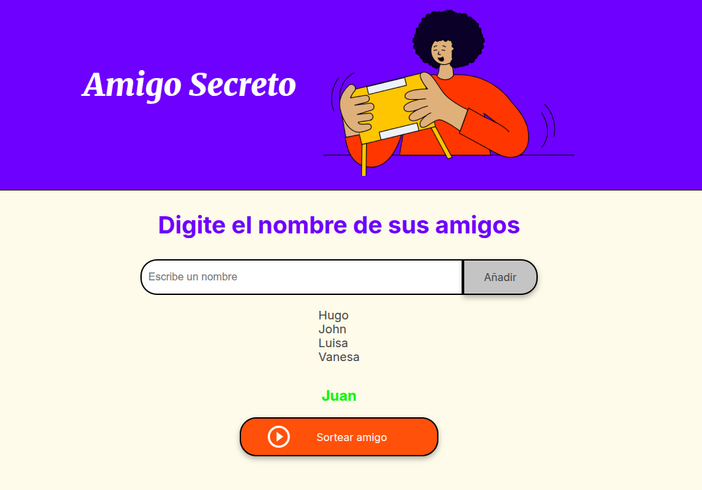
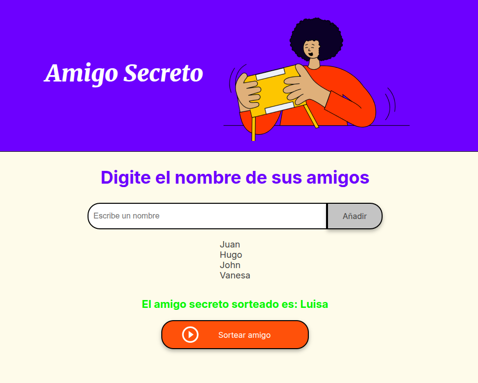

# Secret Friend Challenge

This is a simple **JavaScript project** that simulates a *Secret Friend Raffle*.  
You can add friends to a list, randomly select one of them, and once chosen, that friend is automatically removed from the pool of available participants.

---

## Features
- **Add Friends**: Enter a friend's name and add it to the list.
- **Random Selection**: Select a random friend from the current list.
- **Auto-Remove Selected Friend**: Once a friend has been chosen, they are automatically removed from the list so they cannot be selected again. *(This feature was an improvement I added on top of the basic raffle idea).*
- **Dynamic List Update**: The list of available friends updates in real time.

---

## Project Structure
- **index.html** → Main HTML structure (input, list, and buttons).
- **app.js** → JavaScript logic for adding, displaying, and randomly selecting friends.
- **assets** → Images used in the project.

---

## How It Works
1. Type a friend's name into the input field.
2. Click **Añadir** to include them in the list.
3. When ready, click **Sortear amigo** to randomly pick one.
4. The chosen friend will appear in the results and be removed from the list automatically. (I added this implementation.)

---

## Execution

**Before:**

---
**During:**

---
**After:**

---
Hugo Arnaldo Ramirez Trujillo 2025 - Alura Latam